#Linux内核学习第三周--0和1,从start_kernel到rest_init

**韩洋 + 原创作品转载请注明出处 + 《Linux内核分析》MOOC课程http://mooc.study.163.com/course/USTC-1000029000**

##前言
**文章里的内容部分来自网络，在这里对这些内容的原作者表示感谢**

*本文是网易Mooc课程《Linux内核分析》的第三周作业文章，欢迎阅读，如有疏漏，敬请指出，不胜感激*

##环境搭建
本文内容不依靠实验楼环境，在本机上自主搭建，本次环境搭建按照课程资料可以成功搭建，搭建教程见课程第三周课件《构造一个简单的linux系统》，唯一需要注意的一点是make menuconfig中相关调整：
- 如果机器是64位机器，则需要取消选中 “64-bit kernel”
- 再依次选择kernel hacking-->Compile-time checks and compiler options-->Compile the kernel with debug info，使我们即将编译的内核会带上调试信息

**上述过程完成后即可开始实验**

在完成上述配置后，执行如下命令启动qemu和gdb，开始调试[注意，有些发行版如Archlinux，需要执行的命令如下]
```
	$qemu-system-i386 -kernel [your path]/linux-3.18.6/arch/x86/boot/bzImage -initrd [your path]/rootfs.img -s -S
    $gdb -q
	$(gdb)file [your path]/linux-3.18.6/vmlinux
    $(gdb)target remote :1234
    $(gdb)b start_kernel
  	$(gdb)layout split
 	$(gdb)c
```
这里的缺别是Archlinux上对qemu做了细分，启动指定架构的内核要用对应的qemu命令，这里就是qemu-system-i386

执行完上述命令后，我们会看到qemu停留在start_kernel调用前，截图如下：

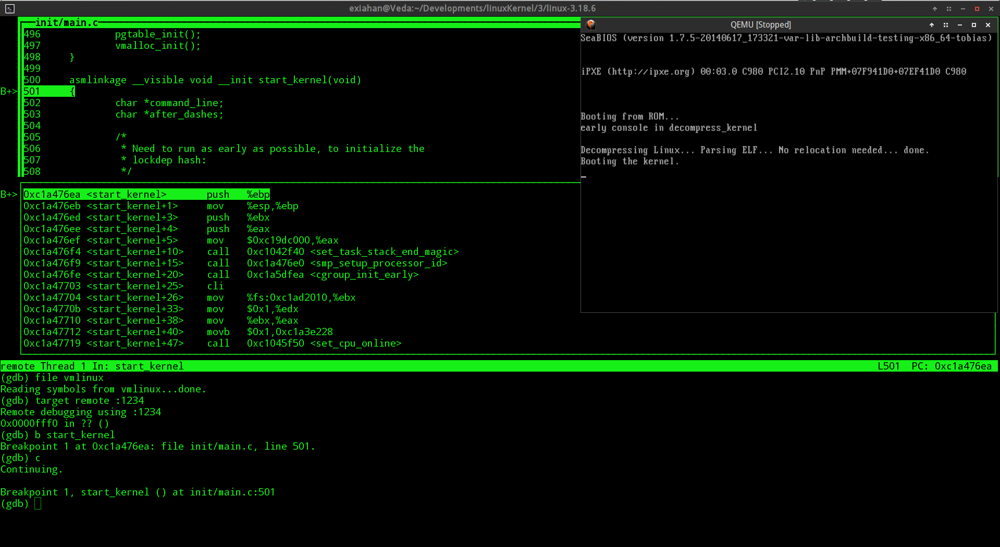

当前可以看到kernel在start_kernel前停下，终端输入
```
	$(gdb)s
```
进入函数，开始分析

**注，由于本人也是linux新手，这里只能通过查阅相关文档和内核源码说明来尽量对启动过程进行详细描述，疏漏之处想必会非常多，希望阅读者发现错误可以告知，共同进步**

*****
####这里对start_kernel函数中一些重要的函数进行说明，循序渐进执行直到rest_init

**首先看第一个函数调用lockdep_init()函数**

可以看到带源码前有段注释，指出这里的模块要尽可能早的加载，目的是为了初始化一张lockdep hash，这是什么呢？我们可以在kernel/locking/lockdep.c看到相关说明，从lockdep.c的注释部分我们可以了解，lockdep.c里实现的功能大概是对运行时的一些[lock]锁操作的正确性进行验证，何为“锁”操作呢，下面也给出了说明：
+ rwsems 内核读写信号量
+ rwlocks 读写锁
+ mutex 同步互斥量
+ spinlocks 自旋锁

**lockdep_init()**的作用就是初始化一张 “lock dependency hash”，从而使lockdep.c里定义的模块可以在运行时检测到如下的lock bugs：
+ lock inversion scenerios 反演锁场景
+ circular lock dependencies 环形锁依赖
+ hardirq/softirq safe/unsafe lock bugs 软/硬中断请求和安全/非安全的“锁”中的bug

为了能够处理内核中的这些同步相关的机制可能引起的一些问题场景，所以内核代码注释中说明该函数要尽早调用，以建立锁依赖的哈希表。

lockdep_init()会首先检测是否已经初始化的lock dependencies hash，如果已经创建则返回，如果没有创建，会执行两个for循环调用**执行同样的内容----调用**INIT_LIST_HEAD()，分别对lockdep classes和lock dependency chain两张链表进行初始化，从名称可以看出，两张表里分别存放了“锁依赖的类型”和“锁依赖链”

*****

**是第二个函数set_task_stack_end_magic(&init_task)**
本函数位于kernel/fork.c文件中，其功能很简单，是手动的把整个linux系统的第一个进程，即**0号进程**的stack的最后一个可用内存地址指向的内存中存入一个magic num，目的是为了检测stackoverflow，即防止栈溢出。
+ 函数首先调用end_of_task()函数获取最后一个可用的栈内存地址，根据其注释，如果栈向下生长，则其最后一个可用内存地址刚好在task_thread_info结构体所在内存之上。
+ 获取到地址后，想该内存块写入0x57AC6E9D，魔数定义位于include/uapi/linux/magic.h
**[至于为什么是0x57AC6E9D,暂时没有找到原因，如果有人知道希望可以告知。]**

在gdb中s到set_task_stack_end_magic函数，然后用p打印传入的参数，可以看到传入的参数是个task_struct，此结构定义位于include/linux/sched.h，这里调用set_task_stack_end_magic时传入的参数是由位于include/linux/init_task.h中的INIT_TASK宏进行初始化，实际上它就是我们的0号进程，即当前进程，在此宏中我们可以看到0号进程的所有信息，同时通过查看gdb中打印的参数信息，我们可以确定这里确实是在对0号进程进行处理，如图：

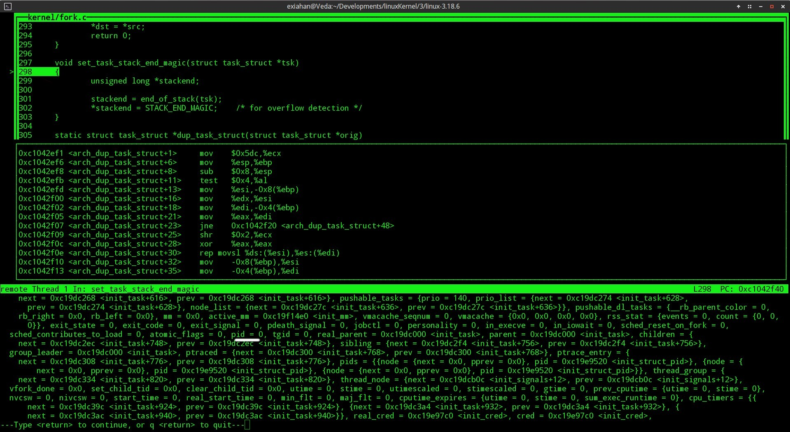

白色划线处成员变量即为pid，这里可以看到pid为0,也即印证了课堂中所说的内容。

*****

**运行，接下来是smp_setup_processer_id()**
此函数被定义为一个**__weak 函数**,这种定义的作用如下：
*若两个或两个以上全局符号（函数或变量名）名字一样，而其中之一声明为weak symbol（弱符号），则这些全局符号不会引发重定义错误。链接器会忽略弱符号，去使用普通的全局符号来解析所有对这些符号的引用，但当普通的全局符号不可用时，链接器会使用弱符号。当有函数或变量名可能被用户覆盖时，该函数或变量名可以声明为一个弱符号。当weak和alias属性连用时，还可以声明弱别名。*[来自http://my.oschina.net/senmole/blog/50887]
通过在实验楼提供的在线linux内核源码浏览上搜索发现x86架构没有找到此函数的定义，Google后发现此函数的作用是定义**当前CPU的逻辑号，如果当前系统中只有一个CPU，则函数什么也不做**[来自http://blog.csdn.net/wzw12315/article/details/6304891]

*****

**debug_objects_early_init()**
此函数用于内核的对象调试，其定义位于lib/debugobjects.c，根据其定义处的注释描述，其会初始化一个hash buckets并且把static object pool里的objects链入一个poll list。此函数调用完成后object tracker将可以正常工作。[这里对hash buckets，static object pool，poll list无法想到合适的翻译名，时间允许的话将在后期查阅并补上]

*****

**boot_init_stack_canary(void)**
从其名字可以看出，为init进程的stack加上“栈警卫”**[栈警卫作用在于检测防止发生stack overflow，至于什么是“栈溢出”，其危害到底如何，请去网上参阅alpha one的文章，http://insecure.org/stf/smashstack.html]**

此函数定义位于arch/x86/include/asm/stackprotector.h，是一个内联函数

*****

**cgroup_init_early**
定义位于kernel/cgroup.c，初始化所有要求在系统启动早期就被启动的子系统。

*****

**local_irq_disable();
early_boot_irqs_disabled = true;**

辗转调用到对应架构的arch_local_irq_disable()方法，关中断。

*****

**在中断关闭的情况下开始进行一系列重要模块的初始化**

+ boot_cpu_init 激活逻辑号排在第一位的CPU
+ page_address_init() 辗转初始化外部变量page_address_pool,用来访问无法被直接映射的高内存区块
+ setup_arch(&command_line)函数定义在arch/x86/kernel/setup.c中，非常重要，初始化当前机器架构对应的环境[一些文章中说这里command_line是由bootloader传入，带有重要架构信息，但是这里用gdb打印信息发现是0x0]
+ mm_init_cpumask(&init_mm) .....没有找到相关说明...
+ setup_command_line(command_line) 存储command_line到static_command_line，存储boot_command_line到saved_command_line
+ setup_nr_cpu_ids() 根据注释，大部分架构都已经在早期设置了nr_cpu_ids，此函数通常是个冗余函数
+ setup_per_cpu_areas() 大概目的是为每个cpu分配内存
+ smp_prepare_boot_cpu() 准备指定架构的钩子
+ build_all_zonelists(NULL, NULL) 建立系统内存页区链表
+ page_alloc_init() .......
+ parse_early_param(void) 解析早期参数，推测为解析一些内核参数
+ pidhash_init() 初始化进程标识符哈希表，根据注释，其建立的哈希表的大小根据本机实际内存大小而调整。
+ vfs_caches_init_early(void) 早期虚拟文件系统缓存初始化
+ sort_main_extable(void) 分类内核内建的异常表
+ trap_init() 设置cpu异常处理函数，即硬件中断向量初始化
+ mm_init 设置内核内存分配管理器
+ sched_init() 初始化调度器，为中断引发的调度设置优先级，根据注释，全部的拓扑结构会在smp_init()中完成初始化。
+ preempt_disable() 如上所述，早期的调度器是很“脆弱”的[功能不完整]，所以这里关闭抢占机制，直到0号进程真正开始运行后，再打开
......
......

+ init_IRQ() 初始化中断请求（关于IRQ：[Wikipedia](http://goo.gl/tHQxlw)）
+ tick_init initialize the tick control，初始化“时钟滴答”控制[这里想了半天没想好怎么翻译，要和下面的时间中断区别开。。。相关参考：http://blog.csdn.net/lee_xin_gml/article/details/7866206]
+ init_timer() 初始化定时器
+ sched_clock_postinit()
+ perf_event_init()
+ profile_init()
+ call_function_init()

*****

**early_boot_irqs_disabled = false;
local_irq_enable();**
完成相关模块初始化后重新打开中断。

*****

**kmem_cache_init_late()**
kmem_cache_init_late的目的就在于完善slab分配器的缓存机制**[参考资料：http://www.cnblogs.com/openix/p/3352652.html]**

*****

**console_init()**
初始化控制台，执行完后tty0将可用

*****

**lock dependences打印和自测**
+ lockdep_info()
+ lockdep_selftest()
根据注释，中断打开后需要运行lockdep_selftest，因为需要自测有没有lock相关的问题，如反演锁bug等。


-----

到这里，我们可以看到qemu里已经有启动信息输出，仔细阅读可以看到上面各模块启动的信息。

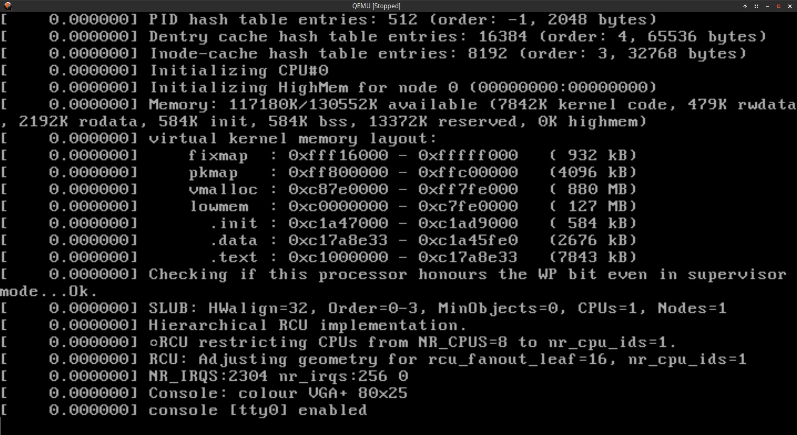

**现在继续走下去：**

+ page_cgroup_init() 页面初始化
+ debug_objects_mem_init() 位于lib/debugobjects.c中，根据注释，其作用在于当 kmem_crashs之后建立一个专用缓冲池，同时有SLAB_DEBUG_OBJECTS被置位。
+ kmemleak_init() mm/kmemleak.c，内存泄漏检测初始化
+ setup_per_cpu_pageset() mm/page_alloc.c，设置每个cpu的页面集合
+ numa_policy_init() 把fs寄存器作为kernel的ds，这里可以这样理解，i386平坦模式下通过ds：address可以访问到全部的4G内存，当然也包括kernel拥有的内存范围，但是fs是一个专门指向kernel所在内存区块的首地址的寄存器。
+ calibrate_delay() 通过观察启动截图，可以看到此函数应该只做了一个延迟功能,如图：

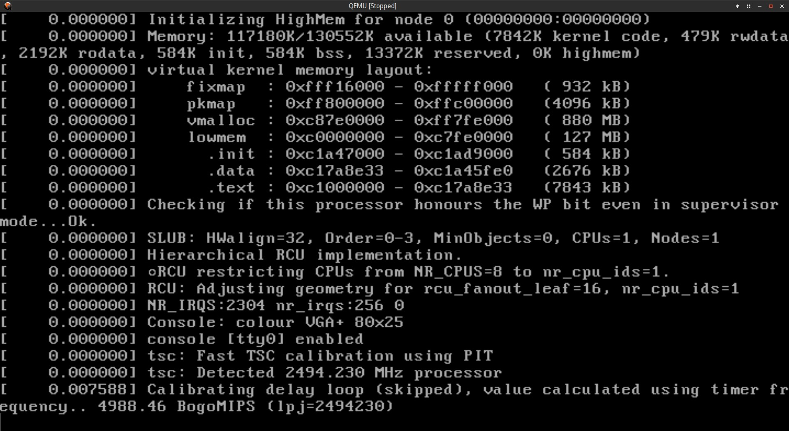

+ sched_clock_init 
+ pidmap_init() kernel/pid.c，pid映射表初始化
+ anon_vma_init()
+ acpi_early_init() ~~根据经验，个人揣测和电源管理有关~~

**接下来如果是x86架构，则还会检测efi引导是否启用，如果启用，还要额外对efi模式进行处理，如果是x86_64，则还需额外调用函数**
```C
	#ifdef CONFIG_X86
	if (efi_enabled(EFI_RUNTIME_SERVICES))
		efi_enter_virtual_mode();
	#endif
    #ifdef CONFIG_X86_ESPFIX64
	/* Should be run before the first non-init thread is created */
	init_espfix_bsp();
	#endif
```

+ thread_info_cache_init() 线程信息缓存初始化
+ cred_init() initialise the credentials stuff
+ fork_init(totalram_pages) fork机制初始化，这个比较重要，因为再后来启动其他用户进程时都会用到fork机制
+ proc_caches_init() initializes the SLAB caches used by the kernel
+ buffer_init() 缓冲区初始化
+ key_init() Initialise the key management state
+ security_init() 安全相关模块初始化
+ dbg_late_init() 与debug相关
+ vfs_caches_init(totalram_pages) 
+ signals_init() 信号量初始化
+ page_writeback_init() 页面写回初始化
+ proc_root_init() 
+ cgroup_init() Register cgroup filesystem and /proc file, and initialize  any subsystems that didn't request early init，注册cgroup文件系统和/proc文件，众所周知，linux会把当前运行的说有进程都在/proc下做一个文件映射
+ cpuset_init() cpuset_init - initialize cpusets at system boot Description: Initialize top_cpuset and the cpuset internal file system，初始化cpusets，和cpuset内部文件系统
+ taskstats_init_early() 任务状态初始化
+ delayacct_init()
+ check_bugs() 
+ sfi_init_late()
+ ftrace_init

单步运行[但不进入]上述代码，此时qemu模拟器输出如图：

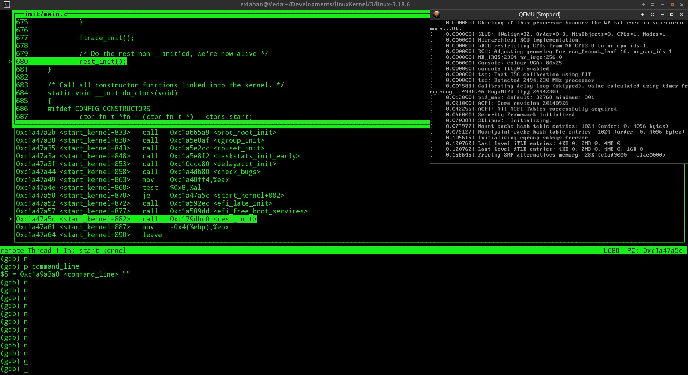

*****

####接下来，就是重要的rest_init，在这里，我们的1号进程将被创建和运行
```
	(gdb) s
```
使用上命令进入rest_init，单步执行，如图：

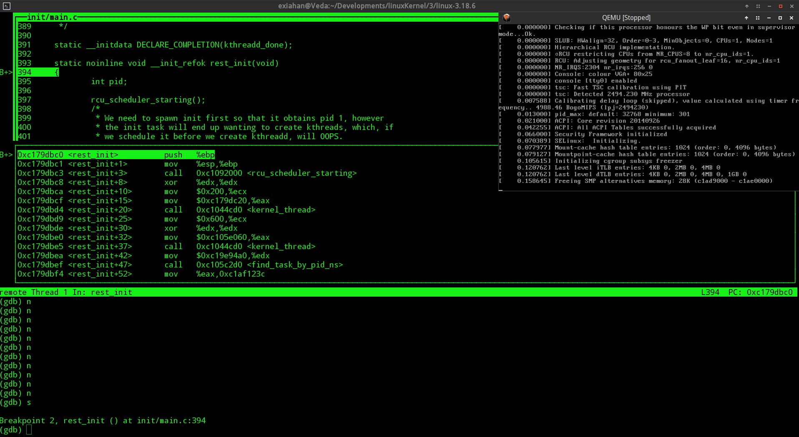

在rest_init内，定义了一个局部变量pid，将用来存放未来通过kernel_thread()创建的一个内核线程标识符

函数内第一个执行的是函数
```C
	rcu_scheduler_starting()
```
首先，什么是RCU，查阅资料后发现，RCU是内核里的一种同步机制。[http://lwn.net/Articles/262464/]
此函数位于kernel/rcu/tree.c中，根据其注释，在调度器初始化完成后此函数才被调用 ，这里看确实也是事实，因为从前面的分析可以看到，调度器初始化函数早于rest_init被调用。此函数的功能如下：被调用前，idle task可能会拥有RCU read-side critical section，即处于读临界区中，根据注释，此时idle task在引导系统启动，当此函数被执行后，idle task被禁止拥有读临界区，同时此函数的调用也讲引发lockdep checking，从前面的分析可以看到，此时lockdep相关模块早已启动，所以可以进行死锁检测。
根据源码可以看到，此函数会检测当前在用的cpu个数，如果不是1会有警告，同时当有多个上下文切换时，也会警告。函数末尾把rcu_scheduler_active设为1。

继续下去，将会执行
`kernel_thread(kernel_init, NULL, CLONE_FS)`
根据代码上方的注释,在这里我们将要“孵化”出init进程，因为它是第一个用户态进程，所以它将活得第一个进程标识符，即成为1号进程，但是在init被创建之前还是要先挂起，等待2号进程kthreadd创建完成，如果在kthreadd被创建前调度init，会出现问题。
首先我们要注意传入的第一个参数kernel_init,实际上它是一个函数指针，在这个函数中最为重要的一句代码：
```C
	if (ramdisk_execute_command) {
		ret = run_init_process(ramdisk_execute_command);
		if (!ret)
			return 0;
		pr_err("Failed to execute %s (error %d)\n",
		       ramdisk_execute_command, ret);
	}
```
即课堂中说的run_init_process，运行我们的1号进程。
进入kernel_thread，可以看到实际上函数对当前的进程做了一次fork操作，实际上就是产生我们的1号进程，把上面的kernel_init指针也传了进来，同时指定了对fs寄存器，打开的文件，而且声明了子进程不被trace。
代码如下：
```C
	pid_t kernel_thread(int (*fn)(void *), void *arg, unsigned long flags)
	{
		return do_fork(flags|CLONE_VM|CLONE_UNTRACED, (unsigned long)fn,
        (unsigned long)arg, NULL, NULL);
	}
```
gdb调试结果如图：

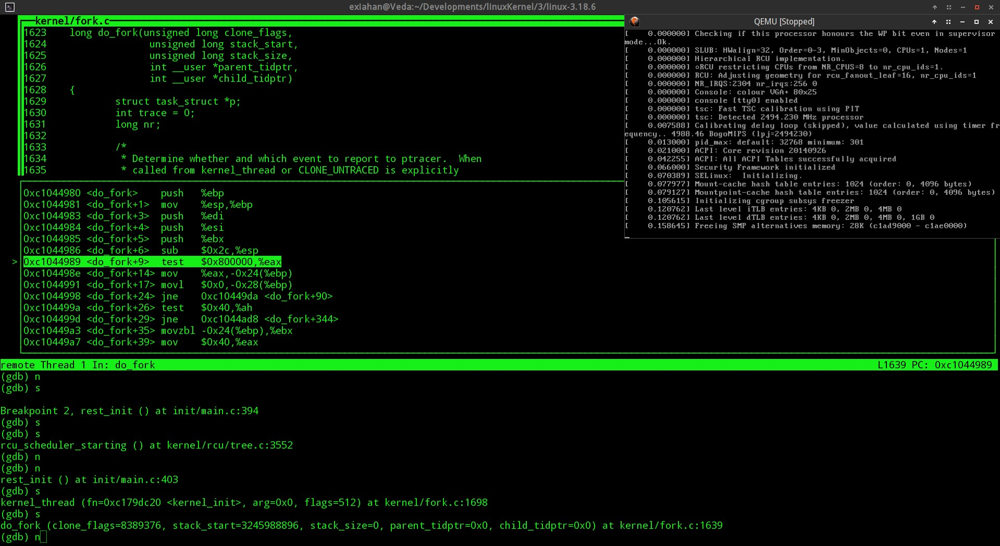

我们继续进入do_fork，看看到底发生了什么：
```
(gdb) s
```
是了，我们会发现do_fork做了两件最重要的事情，调用了copy_process复制了当前进程的信息，根据传进来的flag调整了一些进程参数，然后调用了wake_up_new_task函数，唤醒我们刚刚创建的新进程，即0号进程，然后会通知ptrace[这里因为我们设置了clone_untraced，所以这里不会通知ptrace，调试时确实是会跳过相关的if语句]
上述过程截图如下：

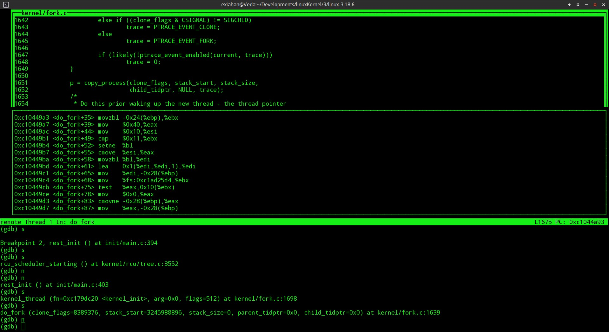
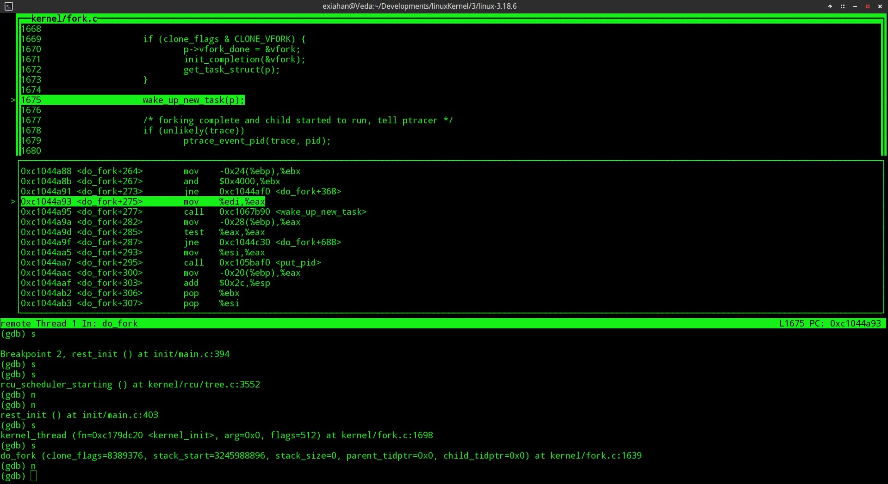

随后调用numa_default_policy重置当前进程的内存策略[什么是内存策略：https://www.kernel.org/doc/Documentation/vm/numa_memory_policy.txt]

再接下来将创建2号进程kthreadd，其本质上是一个内核线程，**kthreadd的用途是管理和调度其他内核线程**，首先我们先查看当前qemu的host机器上kthreadd的pid是多少，结果如图:


可以看到确实为2号进程，继续调试执行，可以看到返回的pid也确实为2，如图：

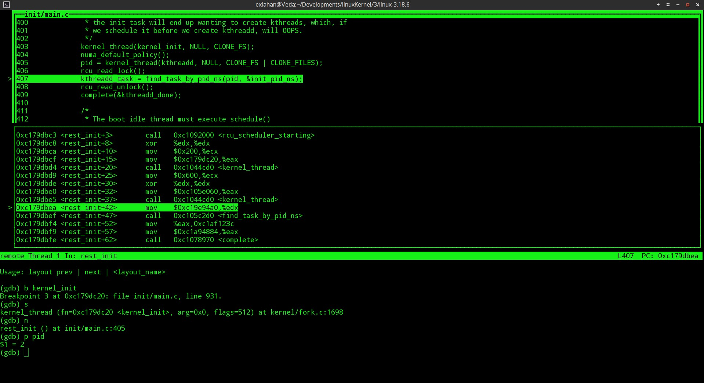

kthreadd创建完成后调用rcu_read_lock进入rcu读方临界区，然后调用find_task_by_pid_ns(pid, &init_pid_ns)获取kthreadd的信息，然后再调用rcu_read_unlock退出rcu读方临界区,这里加上rcu lock的原因是因为find_task_by_pid_ns(pid, &init_pid_ns)的源码注释上说明了调用此函数时必须进行调用rcu_read_lock。如果获取信息成功，则会调用complete[位于kernel/sched/completion.c]函数通知kernel_init。

**接下来是init_idle_bootup_task(current)**
进入函数,查看传入的参数，可以看到current是0号进程的task_struct，函数内把0号进程的调度类型改为idle_sched_class，如下图：

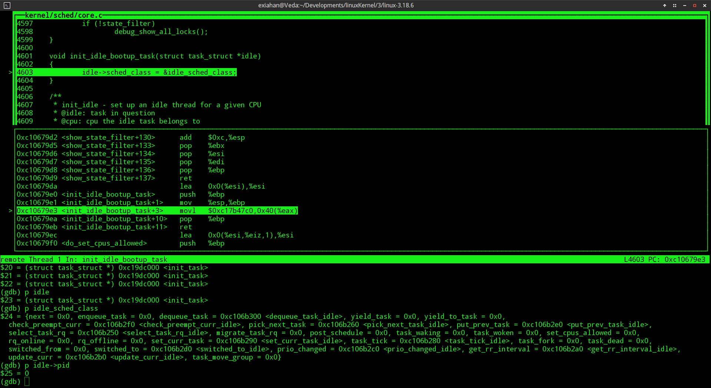

+ 然后会调用schedule_preempt_disabled()来禁用抢占式调度。
+ 再接下去会调用cpu_startup_entry()，根据注释，是在无抢占式调度的情况下调用cpu_idle进程，即0号进程。

在调试器中进入该函数，看到此函数会做如下动作：

+ 调用arch_cpu_idle_prepare()，为对应架构的idle进程运行做准备[本身是一个weak函数]
+ 调用cpu_idle_loop(),此函数是一个无限循环函数，即为我们的0号进程，即idle进程，当系统没有其他任务时，cpu就执行此进程。

###总结
通过上面分析，可以看到，在进入start_kernel的时，init_task就已经被已经被初始化了，而且由后面的某函数的current参数可以知道，当前进程就是0号进程，0号进程执行start_kernel函数，完成内核相关组建的初始化，并且在最后阶段fork出1号进程init和2号进程kthreadd，完成这些工作后，我们的0号进程就彻底退休，进入一个无线循环的函数cpu_idle_loop，成为真正的idle进程。