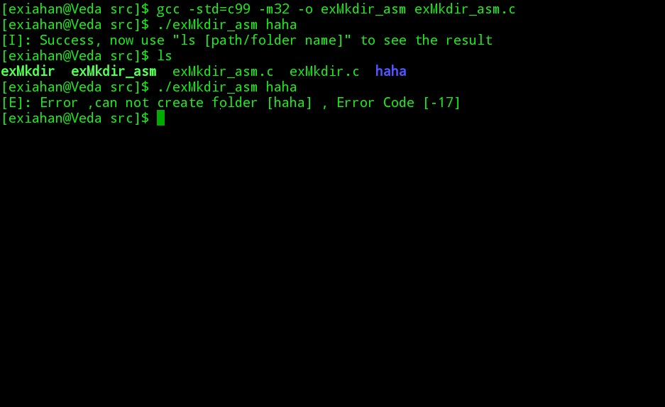

#理解Linux系统调用

韩洋 + 原创作品转载请注明出处 + 《Linux内核分析》MOOC课程http://mooc.study.163.com/course/USTC-1000029000

###Linux系统调用，API和中断之间的关系
由课程视频可知，Linux系统调用是Linux内核为我们提供的一些访问硬件的接口，为我们使用和访问硬件提供了方便。如我们平常使用的rm，mkdir，touch等处理硬盘上文件的命令，其实现过程中都要用到对应的系统调用。但是作为普通用户的我们运行的程序只能运行在用户空间，并不能直接调用处于系统内核态的系统调用，所以系统给我们封装了对应的API[Application Program Interface]来让用户程序可以使用系统调用。下面简单说明系统调用实现过程：

+ 应用程序调用相关API
+ API将对应的系统调用号存入eax，如果需要传参，还要在其他寄存器中传入相关参数，然后调用int $0x80触发中断进入内核中的中断处理函数
+ 内核中的中断处理程序根据系统调用号调用对应的系统调用
+ 系统完成相应功能，将返回值存入eax，返回到中断处理函数
+ **[根据视频中的描述，这里是一个进程调度时机，所以可能会发生进程调度]**
+ 中断处理函数返回到API中
+ API将eax，即系统调用的返回值返回给应用程序

上述过程如图：


###小例子
了解了linux系统调用的实现过程，下面就简单写一个会使用linux系统调用mkdir的小程序，动态分析其过程：

+ 首先是纯C语言版本

```C
/*
 * =====================================================================================
 *
 *       Filename:  exMkdir.c
 *
 *    Description:  Use syscall "mkdir" to create a folder
 *
 *        Version:  1.0
 *        Created:  2015年03月28日 17时46分59秒
 *       Revision:  none
 *       Compiler:  gcc
 *
 *         Author:  ExiaHan 
 *   Organization:  USTC
 *
 * =====================================================================================
 */
#include <stdio.h>
#include <errno.h>
#include <string.h>
#include <sys/stat.h>
#include <sys/types.h>

int main(int argc, char *argv[])
{
    char *filename = NULL;
    mode_t mode = S_IRUSR | S_IWUSR | S_IXUSR | S_IRGRP | S_IXGRP | S_IROTH | S_IXOTH;
    int result = 0;

    if (argc == 1) {
        printf("Usage: %s [PATH/FolderName]\n", argv[0]);
        return -1;
    }
    filename = argv[1];
    if(!(result = mkdir(filename, mode))) {
        printf("[I]: Success, now use \"ls [path/folder name]\" to see the result\n");
        return 0;
    }
    else {
        printf("[E]: Error, failed to create folder [%s], ErrorCode[%s]\n", argv[1], strerror(errno));
        return -1;
    }
}

```
程序很简短，功能是创建用户作为参数传入的同名folder，如：

```
	$ ./[APPNAME] [path/FolderName]
```
会在对应path下创建一个名为FolderName指定的文件夹，并根据结果返回相关信息提示,运行结果如图：


对上述代码进行跟踪调试

```bash
	$gcc -std=c99 -g -m32 -o exMkdir exMdir.c
    $gcc exMkdir -q
    (gdb)layout split
    (gdb)b main
    (gdb)b mkdir
    (gdb)r haha
```
执行上述命令后，程序在首先在main函数开始处停止，单步运行到调用mkdir的语句处，打印出来filename和mode值，因为下面会用到，结果如图：


继续运行，程序会在mkdir函数内停止，如图：


通过显示的mkdir的汇编代码可以看到，从第二句开始的三句汇编代码
```asm
    mov    0x8(%esp),%ecx
    mov    0x4(%esp),%ebx
    mov    $0x27,%eax
```
的作用是分别把调用mkdir时传入的参数filename和mode分别放到了寄存器ebx和ecx中，然后把mkdir对应的系统调用号39,即0x27放入eax。

**这里我们可以看到，不同于32位机器上c语言的默认函数参数传递方式[即参数从右向左入栈]，这里当向系统调用传参时，除了eax用来存放系统调用号，我们传递给mkdir函数的参数filename和mode，是按顺序放入字典序的通用寄存器中，即filename放入ebx，mode让如ecx**

单条指令执行前5句，然后查看寄存器内容，结果如图：


通过与开始时的截图对比可以看到，ecx里存放的是mode的值，ebx里存放的是filename的值，验证了上述结论。
继续执行，程序将会完成相应功能并退出。

##实现上述程序的内联汇编版本
通过上述描述，我们已经知道了系统调用中参数是放在寄存器中传递的，而且也已经知道了是按照什么顺序把我们调用API时传入的参数放入寄存器的。下面给出对应的内联版本。

```C
/*
 * =====================================================================================
 *
 *       Filename:  exMkdir.c
 *
 *    Description:  Use syscall "mkdir" to create a folder in ASM
 *
 *        Version:  1.0
 *        Created:  2015年03月28日 17时46分59秒
 *       Revision:  none
 *       Compiler:  gcc
 *
 *         Author:  ExiaHan 
 *   Organization:  USTC
 *
 * =====================================================================================
 */
#include <stdio.h>
#include <sys/stat.h>
#include <sys/types.h>

int main(int argc, char *argv[])
{
    char *filename = NULL;
    mode_t mode = S_IRUSR | S_IWUSR | S_IXUSR | S_IRGRP | S_IXGRP | S_IROTH | S_IXOTH;
    int result = 0;

    if (argc == 1) {
        printf("Usage: %s [PATH/FolderName]\n", argv[0]);
        return -1;
    }
    filename = argv[1];
    __asm__ __volatile__(
        "movl $0x27, %%eax\n\t"
        "int $0x80\n\t"
        "movl %%eax, %0\n\t"
        : "=m" (result)
        : "c" (mode), "b" (filename)
        : "eax"
    );
    if(!result) {
        printf("[I]: Success, now use \"ls [path/folder name]\" to see the result\n");
        return 0;
    }
    else {
        printf("[E]: Error ,can not create folder [%s] , Error Code [%d]\n", filename, result);
        return -1;
    }
}
```
上述代码将完成同前面纯C语言代码一样的功能，即根据输入参数在指定路径创建指定名称的Folder，并且返回结果信息。

根据前面分析得出的结果，我们分别在ecx中放入mode，ebx中放入filename，然后在eax中放入0x27，即mkdir的中断调用号，然后触发终端执行对应系统调用。结果如图：



可以看到，当已经存在同名文件夹时，我们通过汇编调用的系统调用将返回结果-17
**[但是如果用纯C调用的话，打印errno的值是17，所以这里不能使用strerrno函数来解析，原因猜测和把输出定为输出到result有关，最近略忙，实在没时间细究了，以后会添加上]**

##总结
Linux为我们提供了大量方便易用的系统调用，这些系统调用相对于高级程序语言来说屏蔽了其具体实现，为高级语言程序员访问硬件提供了便利，他们是方便的，但由于其运行于内核态，如果任由用户随意访问也是危险的，因此，在使用系统调用的过程中，用户并不能直接使用系统调用，而是以系统提供的相关API为跳板，经由API产生中断向内核请求相关功能，使用相关系统调用，然后再经由API返回相关结果。