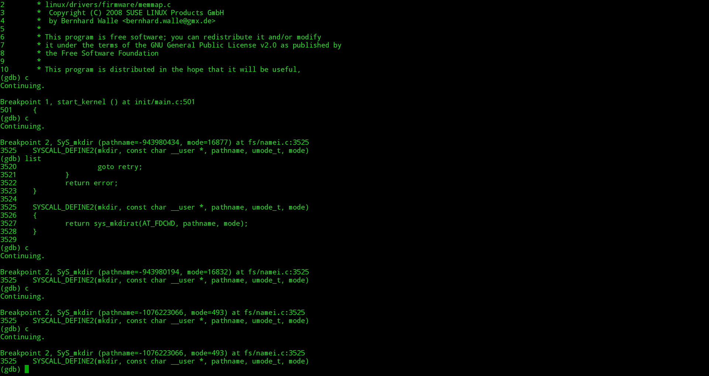

#system_call简单分析---[mkdir 为例]

韩洋 + 原创作品转载请注明出处 + 《Linux内核分析》MOOC课程http://mooc.study.163.com/course/USTC-1000029000

###linux发生系统调用的过程
在上一片博文中，已经描述了发生系统调用，用户态和内核态流程的大致框架，如下图：


可以看到一个系统调用的完成经由用户程序产生中断请求，再由内核中的对应的终端处理过程[system_call]接管中断请求进行处理来完成系统调用，然后再返回用户程序

本篇文章将以围绕一个具体的系统调用mkdir来分析system_call都做了什么

###以mkdir为例分析

####首先把用C和C内联汇编的两个版本的mkdir代码合并如menu工程里的test.c目录下，修改为如下形式:

```C
	int Mkdir(int argc, char *argv[])
    {
        char *filename = NULL;
        mode_t mode = S_IRUSR | S_IWUSR | S_IXUSR | S_IRGRP | S_IXGRP | S_IROTH | S_IXOTH;
        int result = 0;

        if (argc == 1) {
            printf("Usage: %s [PATH/FolderName]\n", argv[0]);
            return -1;
        }
        filename = argv[1];
        if(!(result = mkdir(filename, mode))) {
            printf("[I]: Success, now use \"ls [path/folder name]\" to see the result\n");
            return 0;
        }
        else {
            printf("[E]: Error, failed to create folder [%s], ErrorCode[%s]\n", argv[1], strerror(errno));
            return -1;
        }
    }

    int Mkdir_asm(int argc, char *argv[])
    {
        char *filename = NULL;
        mode_t mode = S_IRUSR | S_IWUSR | S_IXUSR | S_IRGRP | S_IXGRP | S_IROTH | S_IXOTH;
        int result = 0;

        if (argc == 1) {
            printf("Usage: %s [PATH/FolderName]\n", argv[0]);
            return -1;
        }
        filename = argv[1];
        __asm__ __volatile__(
            "movl $0x27, %%eax\n\t"
            "int $0x80\n\t"
            "movl %%eax, %0\n\t"
            : "=m" (result)
            : "c" (mode), "b" (filename)
            : "eax"
        );
        if(!result) {
            printf("[I]: Success, now use \"ls [path/folder name]\" to see the result\n");
            return 0;
        }
        else {
            printf("[E]: Error ,can not create folder [%s] , Error Code [%d]\n", filename, result);
            return -1;
        }
    }
```

然后在加入相关的menuconfig语句
```C
......
	MenuConfig("mkdir","make a directory", Mkdir);
    MenuConfig("mkdir-asm","make a directory(asm)", Mkdir_asm);
......
```

加入后执行

	$make rootfs

运行qemu，并且执行一次，结果如图


下面对mkdir进行跟踪调试：
使用
```bash
	$qemu-system-i386 -kernel /arch/x86/boot/bzImage -initrd rootfs.img -s -S
    $gdb -q
    (gdb)file vmlinux
    (gdb)target remote:1234
    {gdb}b start_kernel
    (gdb)b sys_mkdir
    (gdb)c
````
完成书面输入后，进如qemu，输入

	mkdir hahaha

将会在mkdir处停下，如图：


此时gdb里如图：



由于gdb不能调试内核，所以这里只能通过观察源码分析[给kerenl打上kgdb的补丁后可以用gdb调试，具体方法见https://www.ibm.com/developerworks/cn/linux/l-kdb/]

参考源码[http://codelab.shiyanlou.com/xref/linux-3.18.6/arch/x86/kernel/entry_32.S]
进行分析，流程如下：

+ 收到int 0x80中断请求
+ 进入system_call
+ 执行完请求的系统调用后
+ 判断是否还要处理一些其他的信号，如果没有需要处理的其他信号，则直接返回，否则会处理这些信号
+ 在处理玩这些信号后，判断是否需要进程调度，如果需要调度，则会进行进程调度，然后在未来某个时刻调度回来后再返回。
可以得到如下的流程图：


###结论
对于所有使用int 0x80来请求的系统调用的程序来说，其大致过程都分为如下几点：

+ 进入system_call
+ 完成相关调用
+ 处理其他信息
+ 处理进程调度
+ 返回原程序

由上推广到一般中断处理过程，可以猜测如下：

+ 触发中断
+ 进入内核相关的中断处理过程
+ 完成处理
+ 完成其他信息的处理
+ 进入调度处理过程
+ 返回源程序