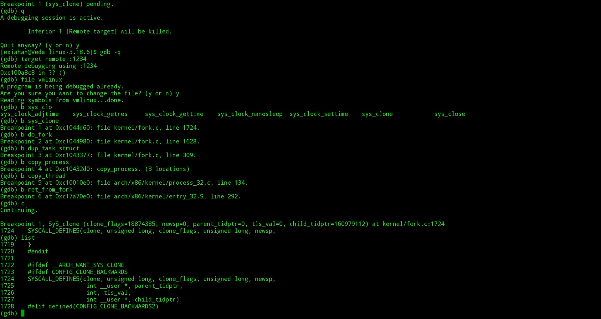

#gdb跟踪Linux的fork过程

**韩洋 + 原创作品转载请注明出处 + 《Linux内核分析》MOOC课程http://mooc.study.163.com/course/USTC-1000029000**

**本文是Mooc网相关课程作业，部分内容来自网络**

####前言
**Fork**机制是linux进程管理中十分重要的概念，在Linux内核启动时，在start_kernel函数里调用rest_init，在rest_init里会通过两个创建kernel_thread后fork出init进程和内核线程管理进程，而init又是所有用户级进程的父进程，即在init创建之后，所有的用户进程都是通过init直接或者简介fork出来的产物。
下面通过对MenuOS里简单的fork功能进行跟踪来简单分析fork到底都做了些什么。

#####准备工作
进入我们之前git clone到本地的menu目录，执行
```bash
    $git pull orgin master
    $mv test.c test.c.bak
    $mv test_fork.c test.c
    $make rootfs
```
更新menu项目的内容，并且用test_fork.c替换test.c，然后make出带有fork命令的init。
让其启动，测试是否成功，如果成功则结果如图：


#####开始分析
根据资料描述，传统的fork系统调用在Linux中是通过clone实现的，而实现clone的系统调用是sys_clone，同样，根据课程内容，MenuOS中执行fork时实际上是通过sys_clone来调用do_fork，按照课程内容中的提示，按照如下方法启动虚拟机并下断点：
```bash
	$qemu-system-i386 -kernel ../arch/x86/boot/bzImage -initrd ../rootfs.img -s -S
    $gdb -q
    (gdb)c
    (gdb)target remote:1234
    (gdb)file vmlinux
    (gdb)b sys_clone
    (gdb)b do_fork
    (gdb)b dup_task_struct
    (gdb)b copy_process
    (gdb)b copy_thread
    (gdb)b ret_from_fork
    (gdb)c
```
注意，gdb连接上后不要立马下断点，否则因为启动时也要用到fork机制创建init和其他进程会导致一直要手动继续执行，所以我们等到进入menuOS界面后再下断也不迟。
在MenuOS中执行一次fork
```bash
	$fork
```
将会成功断下，如图：


此时gdb中如下图：



根据截图，发现执行的sys_clone时是如下的调用：
```C
	SyS_clone (clone_flags=18874385, newsp=0, parent_tidptr=0, tls_val=0, child_tidptr=160979112)
``` 

+ clone_flags 不去深究，其目的大致是指定子进程被创建后继承、具有、屏蔽的一些进程属性。
+ newsp 新进程的sp指针值，这里为0
+ parent_tidptr 父进程的用户太变量地址，这里为0
+ tls_val 线程局部存储段数据结构的地址，这里也为0
+ child_tidptr 新的轻量级进程的用户态变量地址

继续向下执行，进入do_fork，做了如下的do_fork调用
```C
	do_fork (clone_flags=18874385, stack_start=0, stack_size=0, parent_tidptr=0x0, child_tidptr=0x99858a8) 
```
如下图：


通过截图可以看到，在do_fork定义了task_struct的一个指针p和其他几个变量，然后调用copy_process复制了父进程的进程描述符，继续跟踪，会进入copy_process，执行如下调用：
```C
	copy_process (clone_flags=18874385, stack_start=0, stack_size=0, child_tidptr=0x99858a8, pid=0x0, trace=0)
```
如图：


继续执行，在copy_process里会执行
```C
	p = dup_task_struct(current)
```
此函数会为子进程获取进程描述符，大概过程如下：

+ tsk = alloc_task_struct_node(node) 分配一个task_struct
+ alloc_thread_info 获取一块空闲内存区，其参数里有个指向task_struct结构的指针tsk，存放新进程的thraed_info结构和内核栈，通常这块字段的大小是8KB或者4KB,其大概布局是上面是内核栈，最后的空间是thread_info。返回值放入ti
+ 把当前进程的进程描述服的内容复制到tsk指向的task_struct结构中
+ 把task->stack赋值为ti
+ 返回进程描述符指针tsk

继续运行copy_process，进入copy_thread
如图


这里我们看到此时新的进程描述符结构里的pid依然是1
copy_thead大概做了如下工作：

+ 设置sp
+ 设置子进程ip为ret_from_fork

到这里可以看到，子进程将从ret_from_fork开始执行

继续执行，可以看到程序将在ret_from_fork处断下，这里gdb不能继续跟踪。所以不再分析。
如图：


到这里，分析结束。

###总结
Linux中进程并非是凭空而出的，产生一个新用户进程的温床是start_kernel在最后阶段通过产生的init,init通过fork机制直接或这间接的产生新的用户进程，而init本身也是通过fork产生的。Linux通过fork机制，通过如下的大概流程“新分配一个task_struct，拷贝父进程的进程描述符，分配新的内存资源如内核栈等，分配一个新的pid，设置新进程的执行起始为ret_from_fork，加入调度队列等待执行”来执行一个新的进程。