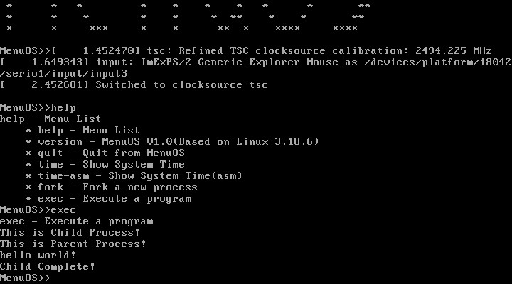
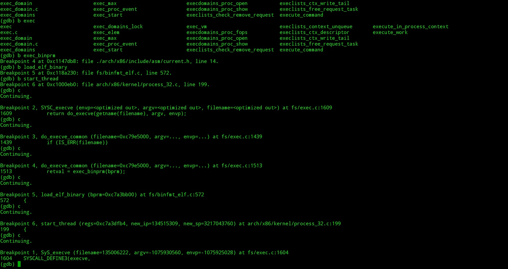
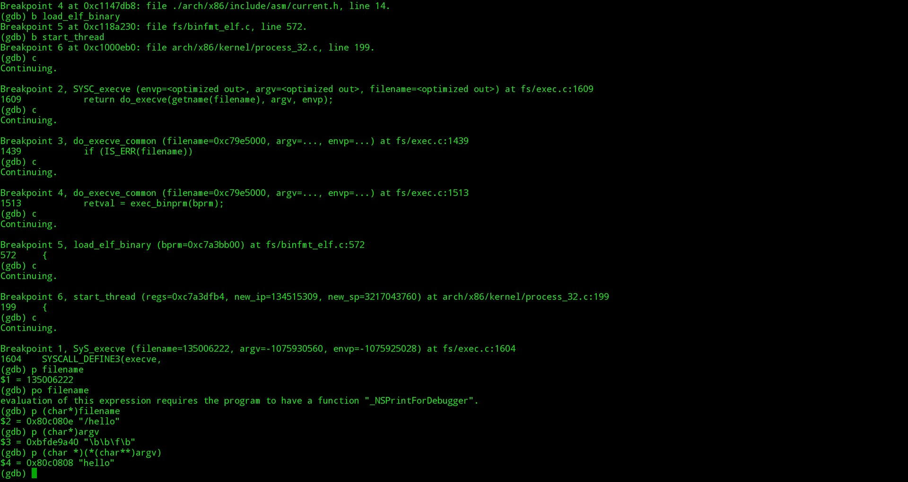
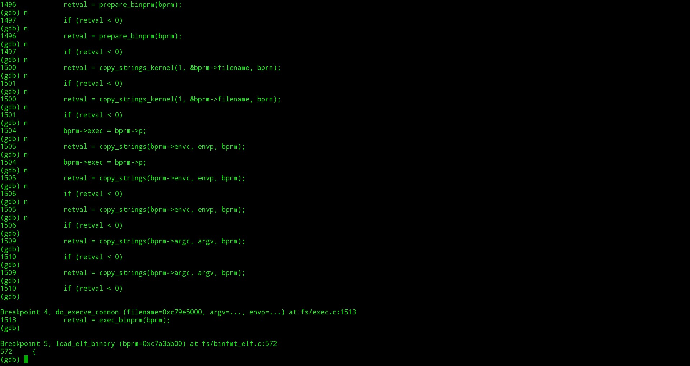
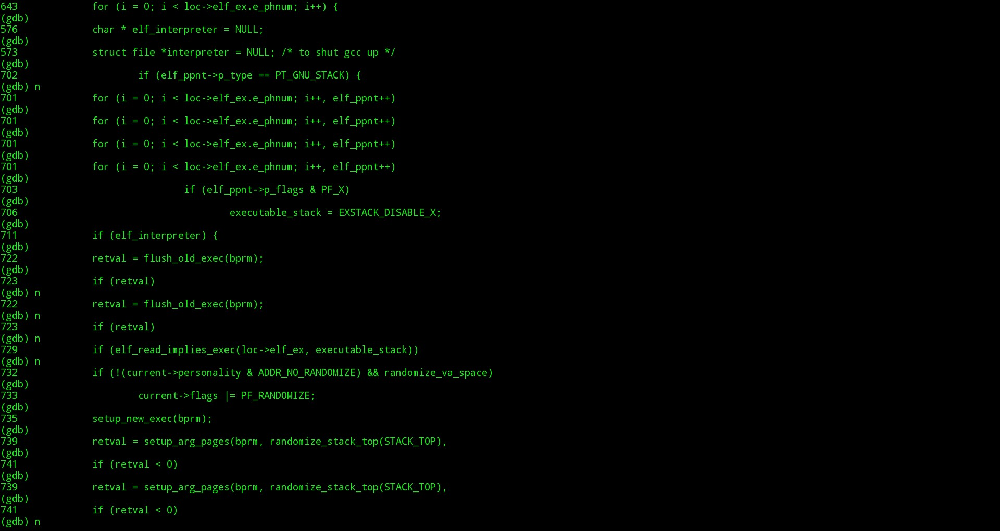
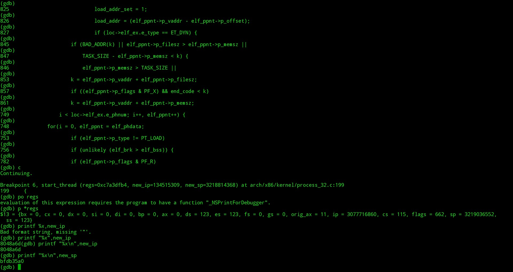
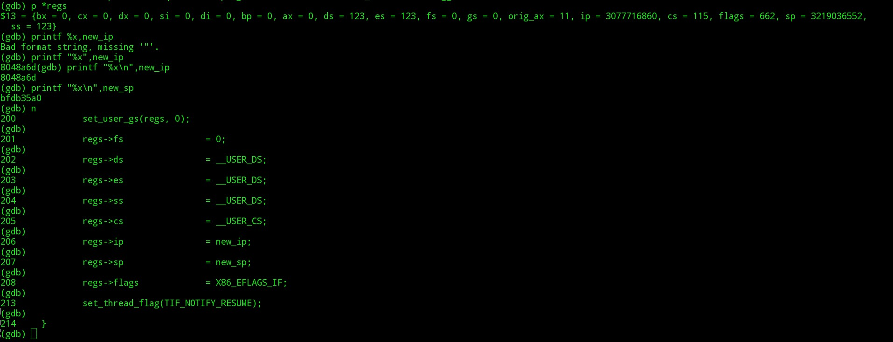

#可执行程序的加载和执行--Linux

韩洋 + 原创作品转载请注明出处 + 《Linux内核分析》MOOC课程http://mooc.study.163.com/course/USTC-1000029000

**上周学习了一个子进程是如何由Fork产生的，本周将简单说明exec*运行一个新可执行程序时发生了什么**

###准备环境
更新之前实验中用到的menu项目
```bash
	$git pull orgin master
    $rm test.c
    $mv test_exec.c test.c
    $make rootfs
```
进入qemu后执行help，查看是否有exec命令，然后执行一次，成功则如下图所示：



使用如下指令开启qemu模拟器,并使用gdb远程链接上下断点
```bash
	$qemu-system-i386 -kernel ../arch/x86/boot/bzImage -initrd ../rootfs.img -s -S
    $gdb
    (gdb)file vmlinux
    (gdb)target remote:1234
    (gdb)b sys_execve
    (gdb)c
    (gdb)b do_execve
    (gdb)b do_execve_common
    (gdb)b exec_binprm
    (gdb)b load_elf_binary
    (gdb)b start_thread
```

然后执行exec，由于exec命令会执行：
```C
	execlp("/hello","hello",NULL);
```
所以会断在sys_execve,如下图：



从图中最后一条Breakpoint1开始，其上是为了下断点而预先执行的一遍。
此时使用
```bash
	(gdb)p (char *)filename
    (gdb)p (char *)(*(char **)argv)
```
可以看到我们调用execlp时传递的参数，如下图：



继续执行,进入do_execve_common，在其中我们进入do_open_exec，可以看到do_open_exec打开文件后返回一个file结构体指针，指向我们指定的文件，这里是hello.
继续进行，会执行sched_exec,执行完后回到do_execve_common，会有如下语句执行：
```C
	bprm->argc = count(argv, MAX_ARG_STRINGS);
    bprm->envc = count(envp, MAX_ARG_STRINGS);
    ...
    retval = copy_strings(bprm->envc, envp, bprm);
    ...
    retval = copy_strings(bprm->argc, argv, bprm);
```
这里可以看到，在do_execve_common里，参数将被拷贝,继续运行，进入load_elf_binary，如图：



在其中可以看到我们获取了当前进程的pt_regs结构指针，检测了elf的平台架构，同时也检测了elf_interpreter的值,最终对调用如下语句对stack进行设置
```C
	retval = setup_arg_pages(bprm, randomize_stack_top(STACK_TOP)
```




继续运行直到start_thread，调用该函数是传入的参数有当前的pt_regs，新进程的入口地址[这里因为是静态连接到程序，所以入口地址就是readelf工具里看到的地址]，新进程的sp值[这里做猜测，之所以要传入该值，是因为ALSR后stack是在0xbfffffff以下有一定浮动的，所以需要确定sp的值，其确定的地方应该就是上面的那句setup_arg_pages(bprm, randomize_stack_top(STACK_TOP)调用后的结果，仅是猜测，以后有空看源码再证实]，打印相关结构体，结果如下图：



再和readelf查看hello里的entry值做比较,如下图：


可见值相同，都是0x08048a6d。继续执行，会修改当前进程的pt_regs，如图



再继续执行，会继续对当前程序的运行环境做进一步的修改，最终exec*启动的hello将取代当前进程，到这里，分析大概结束，在gdb里键入c，让程序重新运行下去，可以看到结果顺利输出。

###总结
exec*命令的目的是执行一个新的可执行文件，但其和fork的区别在于，fork后父进程还能保持原样，但是exec则像是一只"寄生虫"，其执行的最终结果是夺取运行其进程的资源和空间，最后将其“侵蚀”殆尽，然后运行其自己要执行的程序。