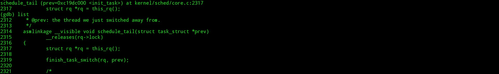

#gdb跟踪schedule

韩洋 + 原创作品转载请注明出处 + 《Linux内核分析》MOOC课程http://mooc.study.163.com/course/USTC-1000029000

###写在开始
*八周的课程到今天就是最后了，我们从最简单的内容入手，通过mykernel分析了简单的进程切换，知道了栈和进程的对应关系，然后知道了如何跟踪调试一个真正的内核，接着碰触到了rootfs，这个内核启动时用到的文件系统，接着我们触摸了系统调用，添加了自己的“伪·shell命令”，然后是子进程诞生记Fork和寄生兽Execuve，最终又回到了开始，回到了进程切换，为什么？因为不管是Fork也好还是Execuve也罢，Fork确实能产生新进程，Execuve确实能吞噬其调用者羽化出新进程，但决定其当前是否应该运行依然是调度说了算，可见进程调度间接掌握着各进程运行的命脉---时间片，就像电影《青鸟》里时间老人说的一样：就算是光明，一样无法战胜无时无刻不在流淌的时间，下面，我们从schedule函数开始，重新分析一次进程的调度*

###准备工作
**本次不需要更新任何git内容，之前任意一次的实验环境都可以**

本次我们要分析Linux内核里的进程调度，我们知道，进程调度可以发生在每次中断返回之前，或者由内核线程主动触发，由于我们目前只能通过gdb远程调试[当然，如果你会用kgdb或者kdb，那么可能有其他方法]，根据之前的课程，我们知道，在内核启动的过程中，也就是在start_kernel函数内，在调用rest_init创建init之后，一定会有一次调度，所以我们就分析这次的调度，现在首先回顾下之前的start_kernel等与之相关代码片段：
```C
	//in ./linux-3.18.6/init/main.c
	start_kernel(){
        ......
        rest_init();
    }
    
    rest_init(){
    	......
    	schedule_preempt_disabled();
    	......
    }
    
    schedule_preempt_disabled()
    {
        sched_preempt_enable_no_resched();
        schedule();//主动调度
        preempt_disable();
    }
```
夹下来，如果我们去查看schedule的实现的话，会发现这样一条
```C
	//in ./linux-3.18.6/kernel/sched/core.c
    __visible void __sched schedule(void)
    {
    	struct task_struct *tsk = current;
    	sched_submit_work(tsk);
    	__schedule();
    }
    
    static void __sched __schedule(void){
    ......
    contex_switch(...);
    }
```
同样，可能与之相关还是有下面一段代码[看名字就知道是干嘛的]：
```ASM
	//in ./linux-3.18.6/arch/x86/kernel/entry_32.S
    ENTRY(resume_kernel)
    DISABLE_INTERRUPTS(CLBR_ANY)
    need_resched:
    cmpl $0,PER_CPU_VAR(__preempt_count)
    jnz restore_all
    testl $X86_EFLAGS_IF,PT_EFLAGS(%esp)	# interrupts off (exception path) ?
    jz restore_all
    call preempt_schedule_irq
    jmp need_resched
    END(resume_kernel)
```
这里可以看到，在这里一定会主动调用调度函数，所以我们按照如下方式下断点,进入到内核源码根文件夹，执行
```BASH
	$qemu-system-i386 -kernel ./arch/x86/boot/bzImage -initrd ./rootfs.img -s -S 
    $gdb
    (gdb)file vmlinux
    (gdb)target remote :1234
    (gdb)b schedule
    (gdb)b __schedule
    (gdb)b context_switch
    (gdb)b __switch_to()
    (gdb)c
```
完成后虚拟机会停在上面rest_init里显示调用的schedule(),通过bt指令查看，可以看到确实停在那里，如图：


下面开始分析。

###跟踪

*****

**说在开头**这次的作业和第一次mykernel有重叠的地方，所以这次主要是补充mykernel里没有说到的内容，这里附上第一次作业的地址，如果上次没弄明白的可以去看下，自我感觉那次作业还算仔细[自卖自夸求不黑(・∀・)]，网址：https://github.com/ExiaHan/linuxKernelStudy/blob/master/secondWeekend/processSwitch.md
[github，可能需要科学上网。。]

*注意*我说的相似部分大概是mykernel里的这段代码片段：
```C
	asm volatile(  
         "pushl %%ebp\n\t" /* save ebp */
         "movl %%esp,%0\n\t" /* save esp */
         "movl %2,%%esp\n\t" /* restore esp */
         "movl $1f,%1\n\t" /* save eip */   
         "pushl %3\n\t"
         "ret\n\t" /* restore eip */
         "1:\t" /* next process start here */
         "popl %%ebp\n\t"
         : "=m" (prev->thread.sp),"=m" (prev->thread.ip)
         : "m" (next->thread.sp),"m" (next->thread.ip)
     );
```
本次分析中的类似片段：
```C
	asm volatile("pushfl\n\t"		/* save    flags */	\
	     "pushl %%ebp\n\t"		/* save    EBP   */	\
	     "movl %%esp,%[prev_sp]\n\t"	/* save    ESP   */ \
	     "movl %[next_sp],%%esp\n\t"	/* restore ESP   */ \
	     "movl $1f,%[prev_ip]\n\t"	/* save    EIP   */	\
	     "pushl %[next_ip]\n\t"	/* restore EIP   */	\
	     __switch_canary					\
	     "jmp __switch_to\n"	/* regparm call  */	\
	     "1:\t"						\
	     "popl %%ebp\n\t"		/* restore EBP   */	\
	     "popfl\n"			/* restore flags */	\
								\
	     /* output parameters */				\
	     : [prev_sp] "=m" (prev->thread.sp),		\
	       [prev_ip] "=m" (prev->thread.ip),		\
	       "=a" (last),					\
								\
	       /* clobbered output registers: */		\
	       "=b" (ebx), "=c" (ecx), "=d" (edx),		\
	       "=S" (esi), "=D" (edi)				\
	       							\
	       __switch_canary_oparam				\
								\
	       /* input parameters: */				\
	     : [next_sp]  "m" (next->thread.sp),		\
	       [next_ip]  "m" (next->thread.ip),		\
	       							\
	       /* regparm parameters for __switch_to(): */	\
	       [prev]     "a" (prev),				\
	       [next]     "d" (next)				\
								\
	       __switch_canary_iparam				\
								\
	     : /* reloaded segment registers */			\
		"memory");
```
可以看到，除掉ret指令，几乎都是一样的，只是开头和结尾多了一个pushfl来保存和恢复标志寄存器，不用ret而是使用jmp __switch_to 来做相似的操作，所以这次主要从这里开始分析。

*****

+ 开始

首先用

- bt
- f
- i f
- i r

查看当前的stack和regs信息，因为下面继续运行的过程中一定会切换栈，所以这里需要观察，如图


此时esp，ebp都是0xc19cffd0，ss寄存器为0x68,继续执行下去,会进入__schedule(),由于我们之前下过断点，所以不用担心会跟丢，此时bt打印栈信息，如下图


继续执行，到达context_switch(),单步进入，在进入前我们将会有机会看到传入的参数rq和prev的值，如下图：


这里比较奇怪的只在之前有语句把rq的值赋为next了，但是这里他们的pid都是0，继续执行，会直接停在__switch_to函数，这时再看两个结构体的pid，就不一样了,分别是init_task，即idle进程和kthreadd，即2号进程，也即之前说过的内核线程管理线程，所以到这里可以确定本次分析的是一次内核进程之间的切换,而且我们知道，__switch_to函数是在switch_to宏里调用的，所以此时栈已经切换，如图


在这里我们刚好能看到到底是怎么不通过ret来从init跳到kthreadd进程的，下面继续进行分析。
下面贴上switch_to的重要代码
```C
	__switch_to(){
    ...
	struct tss_struct *tss = &per_cpu(init_tss, cpu);
    fpu = switch_fpu_prepare(prev_p, next_p, cpu);
    ...
    load_sp0(tss, next);
    load_TLS(next, cpu);
    task_thread_info(prev_p)->saved_preempt_count = this_cpu_read(__preempt_count);
    this_cpu_write(__preempt_count, task_thread_info(next_p)->saved_preempt_count);
    ...
    this_cpu_write(kernel_stack,
    	(unsigned long)task_stack_page(next_p) + THREAD_SIZE - KERNEL_STACK_OFFSET);
    switch_fpu_finish(next_p, fpu);
    this_cpu_write(current_task, next_p);
    return prev_p;
    }
```

+ struct tss_struct *tss = &per_cpu(init_tss, cpu);
		定义一个硬件状态结构体，其内部有个 struct x86_hw_tss 结构体，其定义如下：

```C
        struct x86_hw_tss {
			unsigned short		back_link, __blh;
			unsigned long		sp0;
			unsigned short		ss0, __ss0h;
			unsigned long		sp1;
			/* ss1 caches MSR_IA32_SYSENTER_CS: */
			unsigned short		ss1, __ss1h;
			unsigned long		sp2;
			unsigned short		ss2, __ss2h;
			unsigned long		__cr3;
			unsigned long		ip;
			unsigned long		flags;
			unsigned long		ax;
			unsigned long		cx;
			unsigned long		dx;
			unsigned long		bx;
			unsigned long		sp;
			unsigned long		bp;
			unsigned long		si;
			unsigned long		di;
			unsigned short		es, __esh;
			unsigned short		cs, __csh;
			unsigned short		ss, __ssh;
			unsigned short		ds, __dsh;
			unsigned short		fs, __fsh;
			unsigned short		gs, __gsh;
			unsigned short		ldt, __ldth;
			unsigned short		trace;
			unsigned short		io_bitmap_base;
			}
```
        其中包括了x86架构所有寄存器的信息，所以这里是拿到当前cpu的寄存器信息。
+ fpu = switch_fpu_prepare(prev_p, next_p, cpu);

		这一步是为fpu，浮点处理器的切换做准备，这里不做详细讨论
+ load_sp0(tss, next);

		把next的sp值放入tss结构体里，这里由于优化问题，看不到tss结构体具体的值
+ load_TLS(next, cpu);

		加载next进程的线程本地存储描述符
+ task_thread_info(prev_p)->saved_preempt_count = this_cpu_read(__preempt_count);

		把当前进程[此时依然是prev]的一些信息从当前cpu相关的结构里读出来并存入prev_p指向的thread结构体里，这里可以看成是保存了prev的一些信息
+ this_cpu_write(__preempt_count, task_thread_info(next_p)->saved_preempt_count);

		上一条是保存prev，着一条是把next的写到cpu运行环境里
+ this_cpu_write(kernel_stack,(unsigned long)task_stack_page(next_p) + THREAD_SIZE - KERNEL_STACK_OFFSET);

		写入next进程的stack相关信息
+ switch_fpu_finish(next_p, fpu);

		完成对fpu的一些切换操作
+ this_cpu_write(current_task, next_p);

		把当前进程设置为next进程
+ return prev_p;

		返回

此时进程状态如图：


继续执行，就会进入ret_from_kernel_thread，使用list查看，可以看到其执行的是如下图的操作：


在其中会调用schedule_tail函数，跟踪进去，在其中会调用finish_task_switch(rq, prev);如图：



继续跟踪进入，在其中完成最后的一些切换工作后，就会进入kthreadd进程，如下图


到这里，从0号进程idle到2号进程kthreadd的切换就完成了,继续执行，下一次的调度会进行从2号进程kthreadd切换到1号进程init，如图：


其切换过程大同小异，这里就不再叙述，到这里，跟踪完成。

###总结
结合课程里描述的说有内容，Linux一个新进程的执行离不开中断，在中断中可能是Fork产生新进程，可能是exec使自己变成新进程，但最终其运行都要依靠调度来让其有机会执行，就像老师说的，Linux系统就像是一个Bus，一次只能一个进程进入，然后Bus开动，进程开始有一段时间运行，等到达下一站，Bus会进行调度，其中就有可能把当前坐在其中的乘客[当前进程]撵下车，让新的乘客[新进程]上车开始运行。整个Linux系统就这样周而复始的为每个进程提供服务或者将其赶出去，也正是这种调度机制，使一台机器可以并发的执行多个任务。[好啦，课程完美结束，祝大家都学到了好东西哈～～～～～]