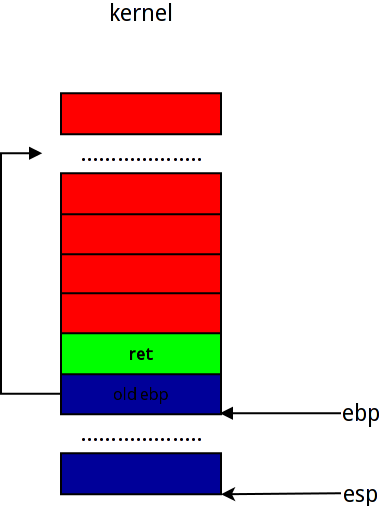

#Stack-Switch 对进程切换的一些理解

韩洋 + 原创作品转载请注明出处 + 《Linux内核分析》MOOC课程 http://mooc.study.163.com/course/USTC-1000029000

*本文为Mooc网相关课程作业，文中可能引用到一些网络资料，在这里对这些资料的原作者提供感谢。*

*****

##前言
现代操作系统以线程为基本调度单位，分为进程内线程调度和进程间线程调度，同时，一个线程对应一个运行栈，所以**Linux**进程调度过程中对栈的操作十分频繁，切换过程中最为重要的就是正确的切换到对应线程的运行栈并且把EIP指向正确位置，接下来将通过本次实验详细解释进程调度过程中运行栈的变化情况。

##实验准备
**写上这段是因为按照说明进行的话并不能看到教学视频上的效果，只能看到时间中断处理程序在执行**

- - -

按照作业页面的说明去**Github**上的[**mykernel**](https://github.com/mengning/mykernel) 项目按照其说明下载“linux 3.9.4内核源码”，然后clone项目到本地，解压内核，然后对内核打patch

	$patch p1 < [your patt]/mykernel/mykernel/mykernel_for_linux3.9.4sc.patch
    
*这里打完补丁后不要直接按照说明直接make，查看patch后内核文件变化可以发现patch并没有写入教学视频中的完整mykernel代码，所以我们要先把代码完整复制过去*

	$cp -rf [your path]/mykernel [your path]/linux-3.9.4/

同时为了缩减时间和使实验效果比较明显，这里我们要对mykernel/myinterrupt.c文件做一点修改，和教学视频里的一样，缩短时间中断处理函数里的时间片，如下：

	void my_timer_handler(void)
    {
  	#if 1
    	if(time_count%1000 == 0 && my_need_sched != 1)
    	{
        	printk(KERN_NOTICE ">>>my_timer_handler here<<<\n");
        	my_need_sched = 1;
    	} 
    	time_count ++ ;  
	#endif
    return;  	
	}

然后再执行编译命令

	$make allnoconfig
    $make

等待编译完成即可通过qemu虚拟机运行我们刚刚编译好的镜像来查看效果

	$qemu-system-i386 [your path]/arch/x86/boot/bzImage

#####运行效果如下：
**这里有四个进程，0, 1, 2, 3互相进行切换**


##代码分析
** 下面我们假设一共有0, 1, 2三个进程，在此基础上对进程调度中运行栈的变化进行说明**
** **
*****


看完实验演示，下面将结合代码对运行栈的变化进行分析：
我们可以看到mykernel路径下有三个C源文件，分别是
- mypcb.h
- mymain.c
- myinterrupt.c
** 其中mypcb.h里定义了**
- PCB结构
- 线程结构
** myinterrupt.c里定义了**
- 我们自己的时钟中断相应函数my_timer_handler(void)
- 调度函数 my_schedule(void)
** mymain.c作为入口，提供了如下功能**
- 入口函数my_start_kernel(void)
- 初始化0号和后继进程
- 示例进程函数

** 下面从mymain.c开始分析**
前面已经说过线程切换中最为重要的是运行栈的切换和EIP的正确跳转
在** my_start_kernel**函数中
```
......
	int pid = 0;
    int i;
    /* Initialize process 0*/
    task[pid].pid = pid;
    task[pid].state = 0;/* -1 unrunnable, 0 runnable, >0 stopped */
    task[pid].task_entry = task[pid].thread.ip = (unsigned long)my_process;
    task[pid].thread.sp = (unsigned long)&task[pid].stack[KERNEL_STACK_SIZE-1];
    task[pid].next = &task[pid];
    /*fork more process */
    for(i=1;i<MAX_TASK_NUM;i++)
    {
        memcpy(&task[i],&task[0],sizeof(tPCB));
        task[i].pid = i;
        task[i].state = -1;
        task[i].thread.sp = (unsigned long)&task[i].stack[KERNEL_STACK_SIZE-1];
        task[i].next = task[i-1].next;
        task[i-1].next = &task[i];
    }
......
```
上面一段代码完成了对0号进程的初始化，同时用类似方法构造了MAX_TASK_NUM - 1个PCB以备使用。这里比较重要的就是PCB结构中的threap.sp，前面说过一个线程对应一个栈，所以在这里我们把thread.sp指向对应PCB内的char stack[KERNEL_STACK_SIZE - 1]的地方，即用这个字符数组作为运行栈，为何指向stack[KERNEL_STACK_SIZE - 1]，是因为** 栈是由高地址向低地址增长**，这个概念一定要深深的印到脑海里。
上述代码做完准备工作后，下面的代码将完成对** 第0号进程的启动**
```
	pid = 0;
    my_current_task = &task[pid];
	asm volatile(
    	"movl %1,%%esp\n\t" 	/* set task[pid].thread.sp to esp */
    	"pushl %1\n\t" 	        /* push ebp */
    	"pushl %0\n\t" 	        /* push task[pid].thread.ip */
    	"ret\n\t" 	            /* pop task[pid].thread.ip to eip */
    	"popl %%ebp\n\t"
    	: 
    	: "c" (task[pid].thread.ip),"d" (task[pid].thread.sp)	/* input c or d mean %ecx/%edx*/
	);
```
这里使用了内联汇编来完成对0号进程的启动，下面对这几句内联汇编做详细分析，启动过程中运行栈的变化情况如下：

*****


** 注意，下面如果无特殊说明，将使用伪汇编指令，即把内联汇编中的%1，%2等对应标号做替换，以方便理解**

+ 当前运行栈情况如图：



这里的ret和old ebp 是my_start_kernel的Prolog操作，ret是my_start_kernel的返回地址，old ebp是调用my_start_kernel函数前的栈基址。

** 这里里需要注意的是，如果内核不是通过call指令调用的my_start_kernel的话，可能内存中没有ret这条，因为即将启动的0号进程不会退出，所以就算没有ret也没有影响**


	movl task[pid].thread.sp, %%esp

本条指令把0号进程当前的栈顶地址放入esp，，此条指令执行后，我们可以认为栈发生了半切换，之所以没有说栈完全切换，因为这里并没有同时更改ebp的值。同时，因为此时0号进程并未运行，所以栈空，esp指向stack[KERNEL_STACK_SIZE - 1]，如图：


这里需要注意的是，前面初始化threa.sp时是

	task[i].thread.sp = (unsigned long)&task[i].stack[KERNEL_STACK_SIZE-1];

所以esp指向的是stack[KERNEL_STACK_SIZE - 1]，并不是有些人认为的esp应该指向stack数组后面紧接的第一个内存地址。