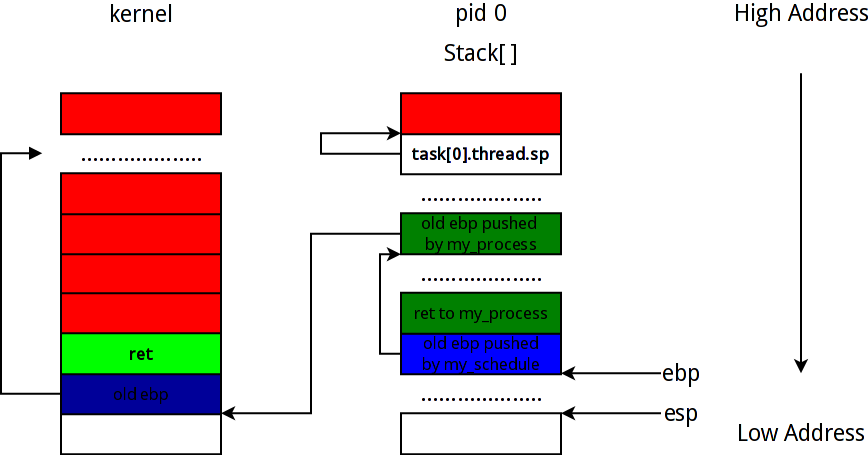
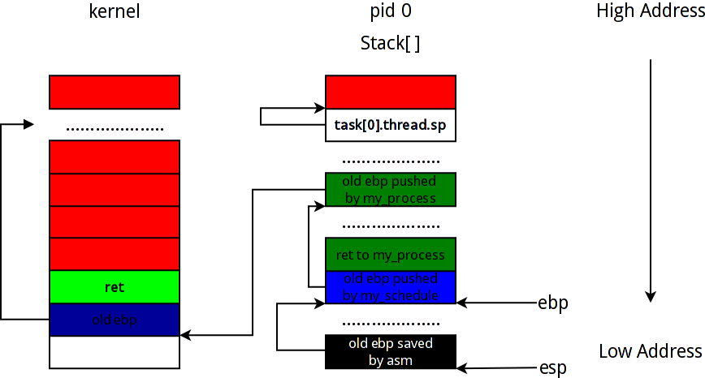
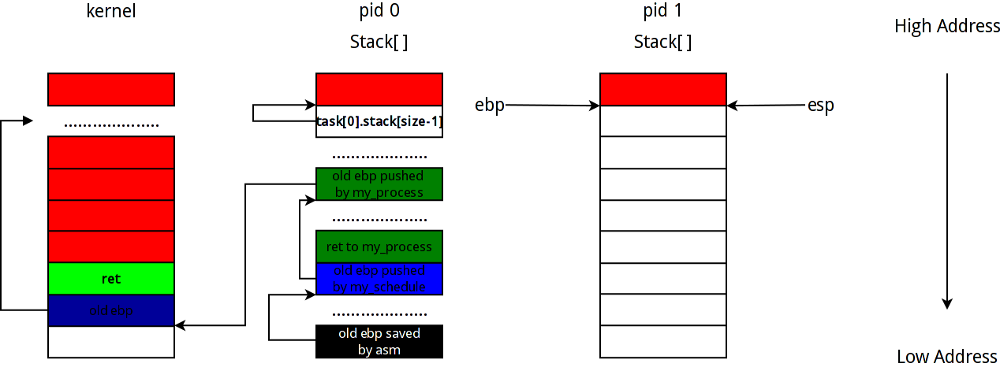
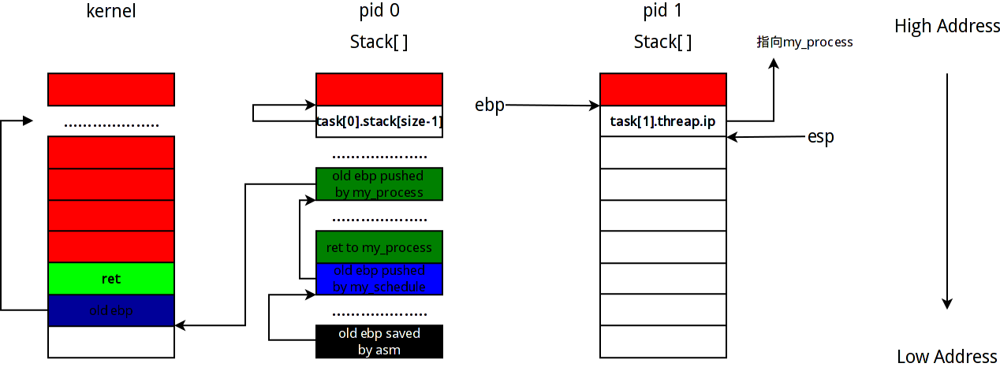

#Stack-Switch 对进程切换的一些理解

韩洋 + 原创作品转载请注明出处 + 《Linux内核分析》MOOC课程 http://mooc.study.163.com/course/USTC-1000029000

*本文为Mooc网相关课程作业，文中可能引用到一些网络资料，在这里对这些资料的原作者提供感谢。*

*****

##前言
进程调度中，最为重要的就是对上下文环境的保存和运行栈的切换，甚至我们可以把进程看成就是一个运行栈[** 现代操作系统通常以线程为基本调度单位，根据具体情况又可以分为内核级的轻量级进程和用户级线程，其调度方式有一定区别，但是其中都要对运行栈进行切换操作**]，接下来将通过本次实验详细解释进程调度过程中运行栈的变化情况。

##实验准备
**写上这段是因为按照说明进行的话并不能看到教学视频上的效果，只能看到时间中断处理程序在执行**

- - -

按照作业页面的说明去**Github**上的[**mykernel**](https://github.com/mengning/mykernel) 项目按照其说明下载“linux 3.9.4内核源码”，然后clone项目到本地，解压内核，然后对内核打patch

	$patch p1 < [your patt]/mykernel/mykernel/mykernel_for_linux3.9.4sc.patch
    
*这里打完补丁后不要直接按照说明直接make，查看patch后内核文件变化可以发现patch并没有写入教学视频中的完整mykernel代码，所以我们要先把代码完整复制过去*

	$cp -rf [your path]/mykernel [your path]/linux-3.9.4/

同时为了缩减时间和使实验效果比较明显，这里我们要对mykernel/myinterrupt.c文件做一点修改，和教学视频里的一样，缩短时间中断处理函数里的时间片，如下：

	void my_timer_handler(void)
    {
  	#if 1
    	if(time_count%1000 == 0 && my_need_sched != 1)
    	{
        	printk(KERN_NOTICE ">>>my_timer_handler here<<<\n");
        	my_need_sched = 1;
    	} 
    	time_count ++ ;  
	#endif
    return;  	
	}

然后再执行编译命令

	$make allnoconfig
    $make

等待编译完成即可通过qemu虚拟机运行我们刚刚编译好的镜像来查看效果

	$qemu-system-i386 [your path]/arch/x86/boot/bzImage

#####运行效果如下：
**这里有四个进程，0, 1, 2, 3互相进行切换**


##代码分析
** 下面我们假设一共有0, 1, 两个进程，在此基础上对进程调度中运行栈的变化进行说明**
** **
*****


看完实验演示，下面将结合代码对运行栈的变化进行分析：
我们可以看到mykernel路径下有三个C源文件，分别是
- mypcb.h
- mymain.c
- myinterrupt.c
** 其中mypcb.h里定义了**
- PCB结构
- 线程结构
** myinterrupt.c里定义了**
- 我们自己的时钟中断相应函数my_timer_handler(void)
- 调度函数 my_schedule(void)
** mymain.c作为入口，提供了如下功能**
- 入口函数my_start_kernel(void)
- 初始化0号和后继进程
- 示例进程函数

** 下面从mymain.c开始分析**
前面已经说过线程切换中最为重要的是运行栈的切换和EIP的正确跳转
在** my_start_kernel**函数中
```
......
	int pid = 0;
    int i;
    /* Initialize process 0*/
    task[pid].pid = pid;
    task[pid].state = 0;/* -1 unrunnable, 0 runnable, >0 stopped */
    task[pid].task_entry = task[pid].thread.ip = (unsigned long)my_process;
    task[pid].thread.sp = (unsigned long)&task[pid].stack[KERNEL_STACK_SIZE-1];
    task[pid].next = &task[pid];
    /*fork more process */
    for(i=1;i<MAX_TASK_NUM;i++)
    {
        memcpy(&task[i],&task[0],sizeof(tPCB));
        task[i].pid = i;
        task[i].state = -1;
        task[i].thread.sp = (unsigned long)&task[i].stack[KERNEL_STACK_SIZE-1];
        task[i].next = task[i-1].next;
        task[i-1].next = &task[i];
    }
......
```
上面一段代码完成了对0号进程的初始化，同时用类似方法构造了MAX_TASK_NUM - 1个PCB以备使用。这里比较重要的就是PCB结构中的threap.sp，前面说过一个线程对应一个栈，所以在这里我们把thread.sp指向对应PCB内的char stack[KERNEL_STACK_SIZE - 1]的地方，即用这个字符数组作为运行栈，为何指向stack[KERNEL_STACK_SIZE - 1]，是因为** 栈是由高地址向低地址增长**，这个概念一定要深深的印到脑海里。
上述代码做完准备工作后，下面的代码将完成对** 第0号进程的启动**
```
	pid = 0;
    my_current_task = &task[pid];
	asm volatile(
    	"movl %1,%%esp\n\t" 	/* set task[pid].thread.sp to esp */
    	"pushl %1\n\t" 	        /* push ebp */
    	"pushl %0\n\t" 	        /* push task[pid].thread.ip */
    	"ret\n\t" 	            /* pop task[pid].thread.ip to eip */
    	"popl %%ebp\n\t"
    	: 
    	: "c" (task[pid].thread.ip),"d" (task[pid].thread.sp)	/* input c or d mean %ecx/%edx*/
	);
```
这里使用了内联汇编来完成对0号进程的启动，下面对这几句内联汇编做详细分析，启动过程中运行栈的变化情况如下：

*****


+ 当前运行栈情况如图：


这里的ret和old ebp 是my_start_kernel的Prolog操作，ret是my_start_kernel的返回地址，old ebp是调用my_start_kernel函数前的栈基址。之所以在old ebp之后留有空隙是因为esp到ebp之间还要有局部变量，也可能会有内存对齐空出的空间，所以当前栈顶距[esp]离当前栈基址[ebp]会有一定距离。

** 这里里需要注意的是，如果内核不是通过call指令调用的my_start_kernel的话，可能内存中没有ret这条，因为即将启动的0号进程不会退出，所以就算没有ret也没有影响**


	"movl %1,%%esp\n\t" 	/* set task[pid].thread.sp to esp */

本条指令把0号进程当前的栈顶地址放入esp，，此条指令执行后，我们可以认为栈发生了半切换，之所以没有说栈完全切换，因为这里并没有同时更改ebp的值。同时，因为此时0号进程并未运行，所以栈空，esp指向stack[KERNEL_STACK_SIZE - 1]，如图：


这里需要注意的是，前面初始化threa.sp时是

	task[i].thread.sp = (unsigned long)&task[i].stack[KERNEL_STACK_SIZE-1];

所以esp指向的是stack[KERNEL_STACK_SIZE - 1]，并不是有些人认为的esp应该指向stack数组后面紧接的第一个内存地址。

	pushl task[pid].thread.sp

本条指令把当前esp的值再次push入新栈，这里的这个操作有问题，因为并没有保存定位my_start_kernel函数运行栈的ebp值，但是因为mykernel把第0号进程作为类似于系统的** 空闲处理进程[idle]**进程，此进程是个无限循环，并不会返回，所以不会触发函数返回问题。

*****
###此处的一点思考

如果假设0号进程会返回，即我们假设OS是单任务系统，每次运行完一个进程后就回到一个输入界面等待用户输入下一个任务，则可以按照如下思路修改：
```
asm volatile(
	 "pushl %%eax\n\t" /*save eax because we will change it*/
     "movl %%esp, %%eax\n\t" /* save current esp*/
     "movl %1,%%esp\n\t" /* set task[pid].thread.sp to esp */
     "pushl %%eax\n\t" /*store the old esp in the new stack*/
     "pushl %%ebp\n\t" /* store the old ebp in the new stack*/
     "call %0" /* start process*/
     "popl %%ebp\n\t" /* when return first restore ebp*/
     "popl %%esp\n\t" /* then restore the esp*/
     "popl %%eax\n\t" /*at last restore the eax*/
     :
     : "c" (task[pid].thread.ip),"d" (task[pid].thread.sp)	/* input c or d mean %ecx/%edx*/
);
```
** 大概思路就是要能保证当前的栈环境能完整恢复，这里比较绕的是我们需要先把当前esp保存到eax里，以为内下一步会切换栈顶，破坏esp内的内容，所以要提前保存，在切换到新栈顶后，我们要先把eax，即old esp入栈，然后再把old ebp入栈，如果反过来入栈，则出栈时会因为先修改了esp导致栈顶先切换而导致无法弹出真正的old ebp。**经测试修改过的代码可以正确运行。

*****


** 下面继续接着mykernel提供的代码分析**

	"pushl %1\n\t" 	        /* push ebp */

按照教程里说的，这里把当前0号进程栈顶作为新的esp入栈，但是其实从上面的分析可以看出来这里是有问题的，所以这里不再解释这句的作用

   	"pushl %0\n\t" 	        /* push task[pid].thread.ip */

把0号进程的入口函数，即my_process()方法的入口地址入栈，此时栈内情况如下图：


 	"ret\n\t" 	            /* pop task[pid].thread.ip to eip */

执行ret，从栈中弹出刚刚放入的my_process()入口地址，开始运行0号进程。

接下来0号进程将开始运行，同时我们提供的时钟中断处理函数也已经在运行中，按照mykernel提供的代码，当my_process()方法内的局部变量i的值为10000000时，将会检查是否需要调度，这里我们假设此时我们时钟中断函数已经设置了调度标志，则将调用sand_priority()方法给当前所有进程[在我们这里是0,1两个进程]重新分配优先级，然后调用my_schedule()方法进行进程调度。

这里为了能够看到栈的切换，我们假设进入调度函数后，会进行进程0到进程1的切换。
由于当前1号进程的pid[1].state是 "-1"，所以将会执行else分支的内容，下面对else分支内的内容进行分析：
首先，代码如下：
```
......

    else
    {
        next->state = 0;
        my_current_task = next;
    	printk(KERN_NOTICE "switch from %d process to %d process\n \
        >>>process %d running!!!<<<\n\n\n",prev->pid,next->pid,next->pid);

     /* switch to new process */
     asm volatile(	
         "pushl %%ebp\n\t" /* save ebp */
         "movl %%esp,%0\n\t" /* save esp */
         "movl %2,%%esp\n\t" /* restore esp */
         "movl %2,%%ebp\n\t" /* restore ebp */
         "movl $1f,%1\n\t" /* save eip */	
         "pushl %3\n\t"
         "ret\n\t" /* restore eip */
         : "=m" (prev->thread.sp),"=m" (prev->thread.ip)
         : "m" (next->thread.sp),"m" (next->thread.ip)
     );
    }

......
```
进入else分支后首先是把1号进程的state改为0,即runnable[可运行]，然后修改当前运行进程指针令其指向1号进程的PCB结构体，执行完后开始执行内联汇编语句，进行进程切换操作
此时栈情况如图：



这里之所以有省略号同样是因为函数内可能有局部变量或者内存对齐等原因，比较重要的是我画出了从0号进程开始运行my_process到调用my_schedule()时两个函数的Prolog,即
```
pushl %ebp
movl %esp, %ebp
```
这两句执行后的结果，因为这里形成的ebp硬链表对于理解栈的切换十分重要。
+ 当进入my_process后，Prolog在栈中放入指向kernel[即my_start_kernel]栈存放old ebp的当前ebp值，然后修改ebp指向old ebp pushed by my_process
+ 进入my_schedule后，prolog在栈中放入指向my old ebp pushed by my_process的当前ebp值，然后修改ebp指向 old ebp pushed by my_schedule
** 如果0号和1号进程是可以返回的，那么ebp将顺着这个硬链表回溯到my_start_kernel运行时的状态。**

下面继续追踪紧接着的汇编代码运行后的栈变化：
```
"pushl %%ebp\n\t" /* save ebp */
"movl %%esp,%0\n\t" /* save esp */
````
首先在0号进程栈中保存当前的ebp，然后将此时的esp值存入task[0].thread.sp，即保存0号进程的运行栈现场。此时栈中情况如图：



```
"movl %2,%%esp\n\t" /* restore esp */
"movl %2,%%ebp\n\t" /* restore ebp */
```
+ 开始进行栈切换，即从task[0].stack，切换到task[1].stack，和切换到0号进程相同，修改esp指向task[1].stack[KERNEL_STACK_SIZE - 1]
+ 同样，由于此时1号进程并没有运行，所以ebp作为栈基址，指向地址和esp相同
此时栈情况如下图：



	"movl $1f,%1\n\t" /* save eip */

这里的$1f是个“Magic Number”，其效果是把一个指向if分支中的如下指令所在内存
```
"1:\t" /* next process start here */
"popl %%ebp\n\t"
```
的值送入task[0].thread.ip，其效果是当下一次进程切换回0号进程时，将会从这里继续执行。
接下来的

	"pushl %3\n\t"

把1号进程的进程入口地址** [这里以因为是1号进程第一次运行，所以就是my_process()的入口地址]**入栈。此时栈中情况如图：



	"ret\n\t" /* restore eip */
从当前栈task[1].stack中弹出刚刚送入的1号进程的入口地址，启动1号进程，进入1号进程后，同样有如下动作，当1号进程的my_process()方法内的局部变量i满足if语句条件后，将检查是否需要调度，这里我们同样假设调度标志已经为真，且经过sand_priority()方法后下一个将被运行的进程为0号进程，则进入my_schedule()开始调度。
此时运行栈情况如图：

